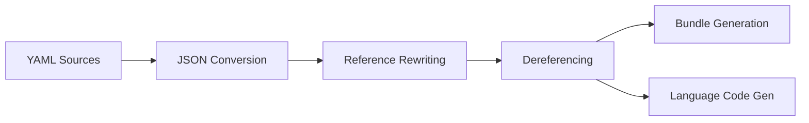

# Architecture Overview

This document explains the technical architecture and design decisions of the Nostr schemata project.

## Design Principles

1. **Standards-based**: Uses JSON Schema Draft-07 for maximum compatibility
2. **Modular**: Schemas can reference and compose each other
3. **Language-agnostic**: Source schemas in YAML, output to multiple languages
4. **Type-safe**: Generated code includes proper type definitions
5. **Extensible**: Easy to add new NIPs, kinds, and message types

## Build Pipeline



### 1. YAML to JSON Conversion

- **Tool**: `yaml-convert`
- **Process**: All `.yaml` files are converted to `.json`
- **Location**: Results stored in `dist/` maintaining source structure

### 2. Reference Rewriting

- **Script**: `scripts/rewriteRefs.js`
- **Purpose**: Convert relative references to absolute paths
- **Example**: `@/note.yaml` → `https://schemata.nostr.watch/note`

### 3. Dereferencing

- **Script**: `scripts/deref.js`
- **Tool**: `@apidevtools/json-schema-ref-parser`
- **Purpose**: Resolve all `$ref` pointers, creating self-contained schemas
- **Result**: Each schema file contains all referenced definitions inline

### 4. Bundle Generation

- **Script**: `build.js`
- **Tool**: `esbuild`
- **Output**:
  - `dist/bundle/schemas.js` - ES module with named exports
  - `dist/bundle/schemas.d.ts` - TypeScript declarations
  - `dist/bundle/schemas.bundle.js` - Minified bundle

### 5. Language Code Generation

- **Tool**: `quicktype`
- **Languages**: Rust, Python, Go, Java, Swift, Kotlin, TypeScript
- **Output**: Type-safe validation code for each language

## Schema Organization

### Alias System (`@/`)

Provides semantic shortcuts to actual schemas:

```
@/note.yaml → nips/nip-01/note/schema.yaml
@/tag/e.yaml → nips/nip-01/tag/e/schema.yaml
```

**Benefits**:
- Shorter, memorable references
- Version independence
- Easier refactoring

### NIP Organization

```
nips/
├── nip-01/           # Core protocol
│   ├── note/         # Base event structure
│   ├── kind-*/       # Specific event kinds
│   ├── messages/     # Protocol messages
│   └── tag/          # Tag definitions
├── nip-XX/           # Other NIPs
└── nipless/          # Experimental kinds
```

### Schema Inheritance

Uses JSON Schema's `allOf` for composition:

```yaml
# kind-1 inherits from base note
allOf:
  - $ref: "@/note.yaml"
  - type: object
    properties:
      kind:
        const: 1
```

## Export System

The `build.js` script generates exports following these rules:

### Naming Convention

1. **Base name processing**:
   - `schema.json` → removed to avoid redundancy
   - `schema.content.json` → `Content`

2. **Tag schemas**:
   - `tag/a/schema.json` → `aTagSchema`
   - `tag/_A/schema.json` → `ATagSchema`

3. **Kind schemas**:
   - `kind-1/schema.json` → `kind1Schema`

4. **Message schemas**:
   - `client-req/schema.json` → `clientReqSchema`

### Export Priority

NIPs take precedence over aliases to avoid naming conflicts.

## Validation Architecture

### Schema Features Used

1. **Type validation**: `type: string|number|object|array`
2. **Format validation**: `pattern` for regex matching
3. **Constraints**: `minimum`, `maximum`, `minItems`, `maxItems`
4. **Conditional logic**: `if/then/else` for complex rules
5. **Composition**: `allOf`, `oneOf`, `anyOf`
6. **Constants**: `const` for fixed values

### Error Handling

Each property includes:
- `errorMessage`: Human-readable validation error
- `description`: Documentation for developers

## Performance Optimizations

1. **Dereferencing**: Eliminates runtime reference resolution
2. **Bundling**: Single file import for all schemas
3. **Minification**: Reduced bundle size for web usage
4. **Tree-shaking**: Named exports allow importing only needed schemas

## Extensibility Points

### Adding New NIPs

1. Create directory: `nips/nip-XX/`
2. Add schemas following conventions
3. Run build process
4. Schemas automatically included in bundle

### Adding New Languages

1. Extend `package.json` scripts for quicktype
2. Add language-specific configuration
3. Generated code placed in `dist/packages/[language]/`

### Custom Validation Rules

Extend schemas with:
- Custom formats
- Additional constraints  
- Business logic via `if/then/else`

## Security Considerations

1. **Input validation**: All schemas validate untrusted input
2. **Size limits**: Arrays and strings have maximum sizes
3. **Pattern matching**: Strict regex for identifiers
4. **Type safety**: Generated code prevents type confusion

## Future Considerations

1. **Schema versioning**: Track breaking changes
2. **Migration tools**: Update events between schema versions
3. **Runtime validation**: WebAssembly for consistent validation
4. **Schema registry**: Decentralized schema discovery